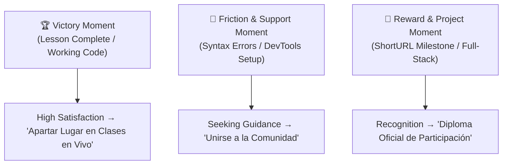

# Funnel Placement & Student Conversion Strategy (from-0-dev)

This document defines the strategic conversion touchpoints, psychological triggers, and placement matrix for forms and community onboarding across the `from-0-dev` platform.

---

## 1. Executive Summary & Psychological Framework

Conversion rates peak when aligned with specific **emotional moments in the student journey**:

---

## 2. Strategic Placement Matrix: "Para no programadores"

| Placement Location | Funnel Stage | Objective | Component / Format | Action Link |
| :--- | :--- | :--- | :--- | :--- |
| **Course Hub / Landing (`src/content/docs/roadmap/para-no-programadores/index.mdx`)** | Top (TOFU) | Onboarding students interested in the 24-week live Sunday cohort starting Sept 6 ($200 MXN/session). | `<CardGrid>` with CTA to Tally form. | [https://tally.so/r/7RrOeP](https://tally.so/r/7RrOeP) |
| **All 12 Lesson Headers & Footers (`1.mdx` to `12.mdx`)** | Mid (MOFU) | Capture self-paced readers who want live instructor accompaniment. | `<Cta />` reusable component. | [https://tally.so/r/7RrOeP](https://tally.so/r/7RrOeP) |
| **Global Roadmap Portal (`src/content/docs/roadmap/index.mdx`)** | Top (TOFU) | General ecosystem navigation. | CardGrid link. | `/roadmap/para-no-programadores/` |
| **Graduation Lesson (`12.mdx`)** | Bottom (BOFU) | Project completion celebration and bridge to Next Course ("Para principiantes"). | CardGrid & `<Cta />`. | [https://tally.so/r/7RrOeP](https://tally.so/r/7RrOeP) |
