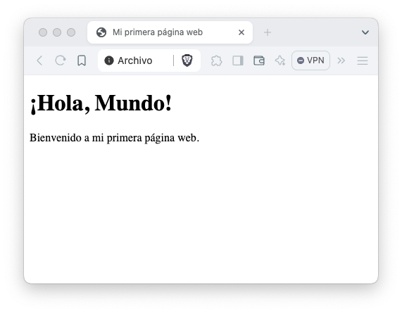
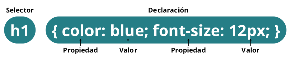
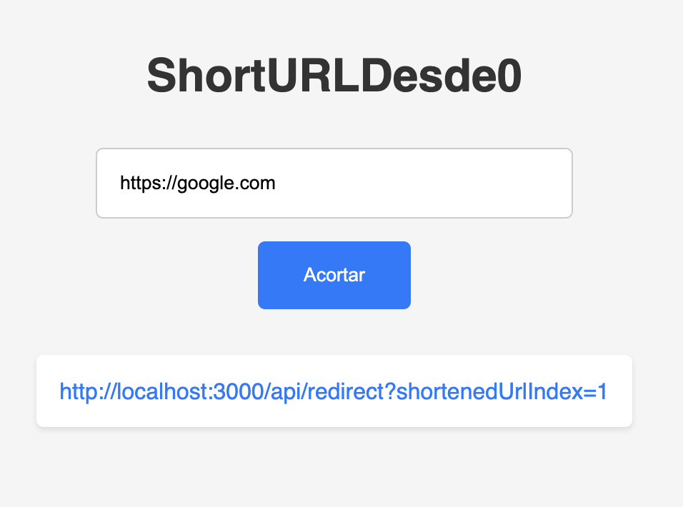

import { Aside } from '@astrojs/starlight/components';
import Cta from '@components/cta/para-no-programadores/cta.astro';

<Cta></Cta>

<Aside title="Referencia">Tanto el front end como el back end son aspectos críticos de cualquier aplicación. El front end es aquello que ven los usuarios e incluye elementos visuales, como botones, casillas de verificación, gráficos y mensajes de texto. Permite a los usuarios interactuar con la aplicación. El back-end son los datos y la infraestructura que permiten que la aplicación funcione. Almacena y procesa los datos de las aplicaciones para los usuarios. - [AWS](https://aws.amazon.com/es/compare/the-difference-between-frontend-and-backend/)</Aside>

En esta clase aprenderás los fundamentos del desarrollo frontend, cómo estructurar y diseñar una página web simple utilizando HTML, CSS, y JavaScript, y las mejores prácticas para comenzar tu camino como desarrollador frontend.

# ¿Qué es el Frontend?

El Frontend es la parte de una plicación o sitio web con la que los usuarios interactúan directamente. INcluye todo lo que los usuarios ven y toan, como botones, imágenes, formularios, y menús de navegación. Los desarrolladores frontend se encargan de traducir el diseño y la funcionalidad en código que el la computadora puede interpretar.

Las principales tecnologías utilizadas por desarrolladores frontend son HTML, CSS y JavaScript.

## HTML: Lenguaje de etiquetas de hipertexto

HTML es el lenguaje de marcado utilizado para crear la estructura básica de una página web. Cada página HTML está compuesta por una serie de elementos que representan diferentes partes del contenido.

```html title="index.html"
<!DOCTYPE html>
<html lang="es">
<head>
    <meta charset="UTF-8">
    <meta name="viewport" content="width=device-width, initial-scale=1.0">
    <title>Mi primera página web</title>
</head>
<body>
    <h1>¡Hola, Mundo!</h1>
    <p>Bienvenido a mi primera página web.</p>
</body>
</html>
```

Expliquemos el ejemplo:
- `<!DOCTYPE html>`: Define que este archivo es un documento de HTML 5.
- `<html>`: Es el elemento raíz que contiene todo el contenido de la página.
- `<head>`: Contiene meta información sobre la página como el título y las referencias a hojas de estilo.
- `<title>`: Especifica un título para la página HTML (Que normalmente se muestra en la pestaña de nuestro navegador).
- `<body>`: Contiene el contenido visible de la página como textos, imágenes y enlaces.
- `<h1>`: Define un encabezado largo.
- `<p>`: Define un párrafo.

No es necesario memorizar todas las etiquetas existentes, pero sí es importante saber que existen muchas opciones disponibles:
https://www.w3schools.com/html/

En HTML utilizamos etiquetas para representar la estructura de nuestras páginas web. Su sintaxis puede variar, es decir, su forma de escribirlas, pero en general se pueden definir de la siguiente manera:

```html
<nombre-de-la-etiqueta>Contenido de la etiqueta (O innerHTML)</nombre-de-la-etiqueta>
```

Como puedes notar, la etiqueta tiene un inicio definido con los símbolos `<` `>` alrededor del nombre de la etiqueta y un final definido con los mismos símbolos, pero añadiendo una diagonal antes después del símbolo `<` y antes del nombre de la etiqueta.

Nuestro ejemplo se vería más o menos así:



## CSS: Hoja de Estilo en Cascada

CSS es el lenguaje de estilos utilizado para describir la presentación de documentos HTML o XML. Esto nos permite editar los colores, fuentes y disposición de los elementos.

```css title="stilos.css"
body {
    font-family: Arial, sans-serif;
    background-color: #f0f0f0;
    color: #333;
    margin: 0;
    padding: 0;
}

h1 {
    color: #007BFF;
    text-align: center;
}

p {
    font-size: 18px;
    line-height: 1.6;
    text-align: center;
}
```

CSS está basado en reglas de estilos. Estas reglas se definen con la siguiente sintaxis:


Puedes consultar la lista completa de propiedades CSS en el siguiente enlace:
https://www.w3schools.com/css/

## Utilizar CSS en HTML

Existen dos maneras de utilizar CSS en HTML.

La primera es agregando una etiqueta `style` dentro de la etiqueta `head`:

```html title="index.html"
<!DOCTYPE html>
<html lang="es">
<head>
    <meta charset="UTF-8">
    <meta name="viewport" content="width=device-width, initial-scale=1.0">
    <title>Mi primera página con estilo</title>
    <style>
        body {
            font-family: Arial, sans-serif;
            background-color: #f0f0f0;
            color: #333;
            margin: 0;
            padding: 0;
        }
        h1 {
            color: #007BFF;
            text-align: center;
        }
        p {
            font-size: 18px;
            line-height: 1.6;
            text-align: center;
        }
    </style>
</head>
<body>
    <h1>¡Hola, Mundo!</h1>
    <p>Bienvenido a mi primera página web con estilo.</p>
</body>
</html>
```

La forma más práctica es creando un enlace de nuestro archivo CSS dentro de la etiqueta `head` de nuestro HTML utilizando la etiqueta `link`:

```html title="index.html"
<!DOCTYPE html>
<html lang="es">
<head>
    <meta charset="UTF-8">
    <meta name="viewport" content="width=device-width, initial-scale=1.0">
    <title>Mi primera página con estilo</title>
    <link rel="stylesheet" href="styles.css">
</head>
<body>
    <h1>¡Hola, Mundo!</h1>
    <p>Bienvenido a mi primera página web con estilo.</p>
</body>
</html>
```

Para fines prácticos, vamos a asumir que tienes una carpeta con los siguientes archivos:

- `index.html`
- `styles.css`

<Aside title="Contenido de los archivos">Puedes copiar el contenido del archivo CSS en el ejemplo anterior: [styles.css](#css-hoja-de-estilo-en-cascada)</Aside>

## JavaScript: Interactividad en páginas web

A diferencia de HTML y CSS, JavaScript sí es un lenguaje de programación. JavaScript nos permite añadir interactividad a nuestros sitios web. Con él podemos hacer que nuestras páginas web respondan a las acciones del usuario.

```js title="scripts.js"
const botón = document.getElementById('botón');
const salida = document.getElementById('salida');

botón.addEventListener('click', () => {
  salida.textContent = '¡Hola! Has hecho clic en el botón.';
});
```

En el ejemplo podemos ver dos constantes: `button` y `output`. JavaScript nos permite acceder a elementos HTML (Definidos como etiquetas) gracias a una técnica llamada [DOM](https://www.w3schools.com/JS/js_htmldom.asp) (Document Object Model o Modelo de objeto de documento).

la función `getElementById` del objeto `document` se utiliza para obtener un elemento identificandolo por su id (Identificador en Inglés). El id se define como propiedad en la etiqueta HTML y debe ser único en cada documento HTML. Si existen múltiples elementos con el mismo id sólo se toma en cuenta el primer elemento.

```html title="index.html"
<!DOCTYPE html>
<html lang="es">
<head>
    <meta charset="UTF-8">
    <meta name="viewport" content="width=device-width, initial-scale=1.0">
    <title>Interactividad con JavaScript</title>
</head>
<body>
    <h1>Interactividad básica</h1>
    <button id="botón">Haz clic aquí</button>
    <button id="botón">Haz clic aquí</button>
    <p id="salida"></p>

    <script>
        const botón = document.getElementById('botón');
        const salida = document.getElementById('salida');

        botón.addEventListener('click', (event) => {
            salida.textContent = '¡Hola! Has hecho clic en el botón ' + event.target.innerHTML;
        });
    </script>
</body>
</html>
```

En el ejemplo utilizamos una etiqueta `script` para escribir nuestro código JavaScript. Y agregamos dos botones con el mismo id. Al momento de presionar cualquier botón, el mensaje siempre indica que se presionó el botón 1.

Para enlazar nuestro documento HTML con un archivo JavaScript podemos utilizar la etiqueta `script` y utilizando la propiedad `src`:

```html title="index.html"
<!DOCTYPE html>
<html lang="es">
<head>
    <meta charset="UTF-8">
    <meta name="viewport" content="width=device-width, initial-scale=1.0">
    <title>Interactividad con JavaScript</title>
</head>
<body>
    <h1>Interactividad básica</h1>
    <button id="miBotón">Haz clic aquí</button>
    <p id="salida"></p>

    <script src="scripts.js" ></script>
</body>
</html>
```

# Ejercicio: Acortador de URLs

Continuando con el desarrollo de nuestro acortador de URLs, agregaremos un archivo CSS y un archivo JS para mantener todo ordenado.

```html title="index.html"
<!DOCTYPE html>
<html lang="en">
<head>
  <meta charset="UTF-8">
  <meta name="viewport" content="width=device-width, initial-scale=1.0">
  <title>ShortURLDesde0</title>
  <link rel="stylesheet" href="styles.css">
</head>
<body>
  <h1>ShortURLDesde0</h1>
  <input type="text" name="url" id="url-to-shorten" placeholder="URL a acortar">
  <input type="submit" value="Acortar" id="shorten-button">
  <ul id="shortened-urls"></ul>
  <script src="scripts.js" ></script>
</body>
</html>
```

En nuestro archivo CSS definimos los estilos de la siguiente manera:
```css title="styles.css"
/*
Aquí se definen los estilos generales del cuerpo (body) de la página:

font-family: sans-serif;: Se establece una fuente genérica sin serif (como Arial o Helvetica) para todo el texto del body.
display: flex;: Se utiliza el modelo de caja flexible (flexbox) para organizar los elementos dentro del body.
flex-direction: column;: Los elementos se apilarán verticalmente, uno debajo del otro.
align-items: center;: Los elementos se centrarán verticalmente.
justify-content: center;: Los elementos se centrarán horizontalmente.
min-height: 100vh;: El body ocupará al menos el 100% de la altura de la ventana gráfica (viewport).
background-color: #f5f5f5;: Se establece un color de fondo gris claro para el body.
margin: 0;: Se eliminan los márgenes predeterminados del body.
*/
body {
  font-family: sans-serif;
  display: flex;
  flex-direction: column;
  align-items: center;
  justify-content: center;
  min-height: 100vh;
  background-color: #f5f5f5;
  margin: 0;
}

/*
Estilos para las etiquetas <h1>:

color: #333;: Se establece un color gris oscuro para el texto del título.
margin-bottom: 2rem;: Se agrega un margen inferior de 2 "rem" (unidad relativa al tamaño de fuente del elemento raíz) al título.
*/
h1 {
  color: #333;
  margin-bottom: 2rem;
}

/*
Estilos para los inputs de tipo "text":

padding: 1rem;: Se agrega un relleno interno de 1 "rem" alrededor del texto dentro del input.
border-radius: 5px;: Se redondean las esquinas del input con un radio de 5 píxeles.
border: 1px solid #ccc;: Se establece un borde sólido de 1 píxel y color gris claro para el input.
width: 300px;: Se establece un ancho fijo de 300 píxeles para el input.
margin-bottom: 1rem;: Se agrega un margen inferior de 1 "rem" al input.
*/
input[type="text"] {
  padding: 1rem;
  border-radius: 5px;
  border: 1px solid #ccc;
  width: 300px;
  margin-bottom: 1rem;
}

/*
Estilos para los inputs de tipo "text" cuando están enfocados (seleccionados):

outline: none;: Se elimina el contorno predeterminado que aparece al enfocar el input.
border-color: #007bff;: Se cambia el color del borde a un azul (#007bff) cuando el input está enfocado.
box-shadow: 0 0 5px rgba(0, 123, 255, 0.5);: Se agrega una sombra suave de color azul alrededor del input cuando está enfocado.
*/
input[type="text"]:focus {
  outline: none;
  border-color: #007bff;
  box-shadow: 0 0 5px rgba(0, 123, 255, 0.5);
}

/*
Estilos para los botones de tipo "submit":

background-color: #007bff;: Se establece un color de fondo azul (#007bff) para el botón.
color: white;: Se establece el color del texto del botón a blanco.
padding: 1rem 2rem;: Se agrega un relleno interno de 1 "rem" arriba y abajo, y 2 "rem" a los lados del texto del botón.
border: none;: Se elimina el borde predeterminado del botón.
border-radius: 5px;: Se redondean las esquinas del botón con un radio de 5 píxeles.
cursor: pointer;: El cursor del ratón cambiará a una mano cuando se coloque sobre el botón, indicando que es interactivo.
transition: background-color 0.3s ease;: Se establece una transición suave de 0.3 segundos para el cambio de color de fondo del botón.
*/
input[type="submit"] {
  background-color: #007bff;
  color: white;
  padding: 1rem 2rem;
  border: none;
  border-radius: 5px;
  cursor: pointer;
  transition: background-color 0.3s ease;
}

/*
Estilos para los botones de tipo "submit" cuando el ratón se coloca sobre ellos:

background-color: #0062cc;: Se cambia el color de fondo del botón a un azul más oscuro (#0062cc) cuando el ratón se coloca sobre él.
*/
input[type="submit"]:hover {
  background-color: #0062cc;
}

/*
Estilos para la lista de URLs acortadas (#shortened-urls):

list-style: none;: Se elimina el estilo de lista predeterminado (viñetas o números).
padding: 0;: Se elimina el relleno interno predeterminado de la lista.
margin-top: 2rem;: Se agrega un margen superior de 2 "rem" a la lista.
*/
#shortened-urls {
  list-style: none;
  padding: 0;
  margin-top: 2rem;
}

/*
Estilos para cada elemento de lista (<li>) dentro de la lista de URLs acortadas:

background-color: #fff;: Se establece un color de fondo blanco para cada elemento de lista.
padding: 1rem;: Se agrega un relleno interno de 1 "rem" alrededor del contenido de cada elemento de lista.
border-radius: 5px;: Se redondean las esquinas de cada elemento de lista con un radio de 5 píxeles.
margin-bottom: 1rem;: Se agrega un margen inferior de 1 "rem" a cada elemento de lista.
box-shadow: 0 2px 4px rgba(0, 0, 0, 0.1);: Se agrega una sombra suave debajo de cada elemento de lista para darles profundidad.
display: flex;: Se utiliza el modelo de caja flexible (flexbox) para organizar los elementos dentro de cada elemento de lista.
justify-content: space-between;: Los elementos dentro de cada elemento de lista se distribuirán con espacio máximo entre ellos.
align-items: center;: Los elementos dentro de cada elemento de lista se centrarán verticalmente.
*/
#shortened-urls li {
  background-color: #fff;
  padding: 1rem;
  border-radius: 5px;
  margin-bottom: 1rem;
  box-shadow: 0 2px 4px rgba(0, 0, 0, 0.1);
  display: flex;
  justify-content: space-between;
  align-items: center;
}

/*
Estilos para los enlaces (<a>) dentro de la lista de URLs acortadas:

color: #007bff;: Se establece un color azul (#007bff) para el texto de los enlaces.
text-decoration: none;: Se elimina el subrayado predeterminado de los enlaces.
*/
#shortened-urls a {
  color: #007bff;
  text-decoration: none;
}

/*
Estilos para los enlaces (<a>) dentro de la lista de URLs acortadas cuando el ratón se coloca sobre ellos:

text-decoration: underline;: Se agrega un subrayado al texto de los enlaces cuando el ratón se coloca sobre ellos.
*/
#shortened-urls a:hover {
  text-decoration: underline;
}

/*
Esta sección define estilos que solo se aplicarán cuando el ancho de la pantalla sea igual o menor a 400 píxeles:

input[type="text"] { width: 100%; }: En pantallas pequeñas, los inputs de tipo "text" ocuparán el 100% del ancho disponible de su contenedor padre.
*/
@media (max-width: 400px) {
  input[type="text"] {
    width: 100%;
  }
}
```

Con este estilo implementado deberíamos poder ver una página más interesante:



Y nuestro JavaScript sólo será modificado un poco:

```diff lang="js" title="scripts.js"
// Cargamos los elementos utilizando el DOM
const urlToShortenInput = document.getElementById('url-to-shorten');
const shortenButton = document.getElementById('shorten-button');
const shortenedUrlsList = document.getElementById('shortened-urls');
// Creamos un arreglo para almacenar los urls que acortaremos
const shortenedUrls = [];

// Configuramos el evento de click para acortar los urls
shortenButton.addEventListener('click', () => {
  // Ejecutamos la función para acortar urls
  shortURL();
});

function shortURL() {
  // Tomamos el valor de nuestro url a acortar
  const urlToShorten = urlToShortenInput.value;
  // Si nuestro valor no es falsy agregamos el url a la lista
  if (urlToShorten) {
-    shortenedUrls.push(urlToShorten);
-    // Ejecutamos la función para dibujar la lista de urls acortados
-    renderShortenedUrls();
+    // Fetch nos permite hacer una solicitud http a nuestro backend
+    fetch('http://localhost:3000/api/shorturl?urlToShorten=' + urlToShorten)
+      // La función then nos responde con un objeto que convertiremos en JSON utilizando la función `json`
+      .then(response => response.json())
+      // Después podemos agregar el URL acortado a nuestro arreglo y renderizar nuestra lista
+      .then(json => {
+        shortenedUrls.push(json.shortenURL.shortenedUrl);
+        renderShortenedUrls();
+      })
+      // En caso de error podemos mostrarlo en la consola
+      .catch(error => console.error(error));
  }
}

function renderShortenedUrls() {
  // Eliminamos el contenido de nuestra lista
  shortenedUrlsList.innerHTML = '';
  // Recorremos la lista de urls acortados
  for (let shortenedUrl of shortenedUrls) {
    // Agregamos un elemento a la lista por cada url acortado
    shortenedUrlsList.innerHTML += `<li><a href="${shortenedUrl}" target="_blank">${shortenedUrl}</a></li>`;
  }
+ // Limpiamos el texto de nuestro input
+ urlToShortenInput.value = '';
}
```

Con esta implementación vemos una interfaz de usuario más presentable, pero nuestra aplicación aún no funciona. Para hacerla funcionar debemos actualizar nuestro Backend. Pero eso lo veremos en la siguiente clase.

<Cta></Cta>