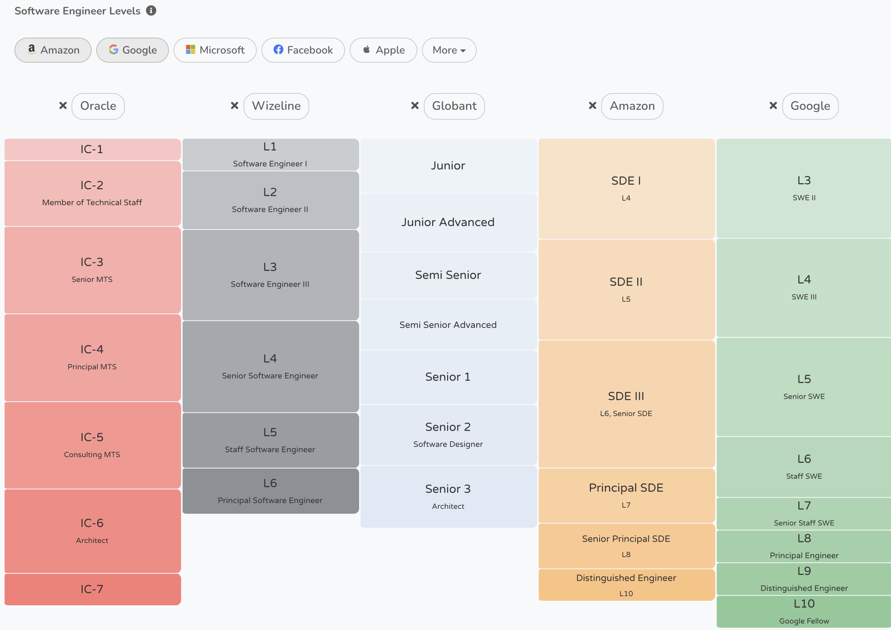

import Cta from '@components/cta/para-principiantes/cta.astro';

<Cta></Cta>

Prepárate para conseguir tu primer empleo como programador Junior. Desarrolla los fundamentos para emprender tu carrera en cualquier Stack que te propongas. 

Este taller te guiará en el proceso para considerarte desarrollador Junior. Así que definamos qué significa ser un desarrollador Junior.

## ¿Qué significa ser Junior Dev?

Aunque no hay un concenso para definir los diferentes niveles de desarrollo de software, podemos inspirarnos de las grandes empresas para ponernos en perspectiva.

Empresas como Apple, Google y Facebook definen niveles internos para sus empleados. Cada nivel puede ser comparado con otro nivel en otra empresa pero nunca van a ser iguales.

Muchas personas denominan a los desarrolladores como Junior, Mid y Senior. Sin embargo, las grandes empresas toman un enfoque distinto.

En general, estas grandes empresas definen sus niveles de la siguiente manera:

| Niveles | Descripción |
| --- | --- |
| L0 - L2 | Programador o Desarrollador |
| L3 - L5 | Junior - Mid - Senior |
| L6 - L8 | Alto, alto impacto |

Hay niveles del 0 al 8. Cada uno de estos niveles significa que yo estoy creciendo en una de las rutas profesionales en las que decidí especializarme.

Estos niveles se suelen utilizar para Contribuidores Individuales (Individual Contributors IC) y puede tomar de 1 a 3 años crecer por nivel.

### L0 - L2

En estos niveles no hay necesidad de tener habilidades de ingeniería.

### L3 - L5

A partir del L3 debemos tener talento de ingeniería. Llegar a nivel 3 significa que debemos crecer constantemente. Estancarse en estos niveles puede significar que algo estamos haciendo mal y podría significar perder nuestro empleo.

El nivel 3, 4 y 5 es lo que podríamos considerar Junior, Mid y Senior.

### L6 - L8

Y a partir del nivel 6 tenemos que cambiar la perspectiva. Estos niveles se logran adquirir cuando la tecnología que creamos tiene un alto impacto en nuestra compañía. Entre más impacto tiene nuestro desarrollo, mayor nivel podremos alcanzar.

De esta manera, el nivel 8 suele ser ocupado por el equipo fundador (Foundation Teams).

## ¿Cómo puedo saber qué nivel tengo?

La forma más adecuada para definir tu nivel es típicamente asistir a entrevistas de trabajo y recibir una oferta que determine tu nivel.

Puede parecer obvio, pero muchas personas esperan a tener un nivel antes de aplicar a las ofertas de trabajo existente.

Para fines prácticos debemos definir una estrategia diferente para cada persona. Esto significa que dependerá de ti mismo averiguar tu nivel. Sin embargo, podemos utilizar este taller como una guía paso a paso para determinar nuestro nivel y la prueba final deberá ser conseguir nuestro primer trabajo como Junior Dev.

En estas 12 semanas incrementarás tus habilidades en desarrollo de software hasta lograr adquirir las bases suficientes para casi cualquier puesto de Junior Dev. Digo casi porque habrá siemrpe algunas empresas que no saben lo que están buscando o simplemente tú no eres lo que buscan y no tendrá nada que ver con tu nivel sino con sus expectativas.

## Requisitos del taller

- **Un computador personal**.
- **Una conexión a internet:** Es esencial contar con una conexión estable.
- **Conocimiento de computación básica:** Deberías saber cómo usar una computadora, navegar por internet, usar aplicaciones de escritorio y gestionar archivos y carpetas.
- **Saber programar o haber programado en por lo menos un lengauje de programación:** Java, JavaScript o lenguajes modernos.

## Estructura del taller y temario

Cada semana veremos un tema nuevo por lo que es crucial seguir el orden y estudiar en casa.

### La sesión en vivo/presencial estará organizada de la siguiente manera:

- **Preguntas y respuestas del tema anterior y conclusiones:** Comenzaremos con una revisión del tema previo, resolviendo dudas y resumiendo los puntos clave aprendidos.
  
- **Introducción al nuevo tema y definición de objetivos:** Presentaremos el nuevo tema de la semana, estableciendo metas claras para la sesión y los conocimientos a adquirir.

- **Práctica semanal asistida:** Realizaremos ejercicios prácticos sobre el tema, con asistencia y guía del instructor para asegurar la correcta aplicación de los conceptos.

- **Exposición de resultados y preguntas:** Los participantes mostrarán los resultados de sus prácticas, seguidos de una sesión de preguntas y retroalimentación.

- **Definición de práctica en casa:** Se asignarán tareas para realizar en casa, diseñadas para reforzar el aprendizaje y preparar a los estudiantes para la siguiente sesión.

### Temario

1. **Introducción y Configuración del Entorno:** Pondremos en perspectiva las expectativas del taller y objetivo y configuraremos nuestro entorno de desarrollo.
2. **Introducción a la Programación Orientada a Objetos:** Clases, instancias, objetos, herencia, cohesión, abstracción, acoplamiento y encapsulamiento.
3. **Control de versiones con Git:** Utilizaremos [Learning Git Branching](https://learngitbranching.js.org/) para dominar las bases del control de versiones.
4. **Desarrollo Frontend:** Crearemos una aplicación Web moderna utlizando ReactJS.
5. **Desarrollo Backend:** Crearemos una API para nuestra aplicación Web siguiente el formato de OpenAPI utilizando Node.JS y Express.JS.
6. **Bases de Datos:** Utilizaremos un DBMS para configurar nuestra base de datos de forma local.
7. **Integración Frontend y Backend:** Conectaremos nuestra Web App a nuestro API a través de un cliente HTTP. 
8. **Uso de la Terminal y Sistemas Operativos:** Analizaremos las diferentes terminales por sistema operativo y cómo podemos aprovechar sus características.
9. **DevOps Básico:** Entenderemos el proceso de planeación, codificación, construcción, pruebas, liberación, despliegue, operación y monitoreo en el proceso de desarrollo.
10. **Desarrollo de Aplicaciones Móviles:** Aprenderás a utilizar ReactNative para crear aplicaciones para escritorio, móviles e incluso web.
11. **Metodologías Ágiles y Buenvas Prácticas:** Conocerás los principios del manifiesto ágil y te compartiré buenas prácticas de trabajar en equipo.
12. **Proyecto Final y Preparación para el Empleo:** Publicarémos un sitio web en donde tendrás tu blog personal así como tus proyectos profesionales para compartir en tus redes. Además, prepararás tus redes sociales y tu CV para aumentar las probabilidades de conseguir un trabajo como Junior Dev.

## Instrucciones para configurar mi entorno de desarrollo

A lo largo del taller repasaremos en cada lección las herramientas que utilizaremos. Sin embargo, vamos a configurar nuestro entorno para poder desarrollar y sacarle más provecho al tiempo de las sesiones en vivo.

### [Instalar Git](https://git-scm.com/book/es/v2/Inicio---Sobre-el-Control-de-Versiones-Instalaci%C3%B3n-de-Git)

Git nos permitirá guardar un registro de cada versión de nuestro código. Cada vez que hagamos un cambio en nuestro código, podremos guardarlo con git de forma local y podremos almacenarlo en un servidor de git de forma remota para tener un rastro del desarrollo de nuestro proyecto.

### [Instalar React](https://es.react.dev/learn/installation)

React nos permitirá crear aplicaciones web utilizando una [programación declarativa](/roadmap/para-no-programadores/4). Y para crear aplicaciones más complejas utilizaremos un framework llamado [Next.JS](https://nextjs.org/) para soportar funciones avanzadas.

### [Instalar Node.JS](https://nodejs.org/en/download/package-manager)

Utilizaremos Node.JS para desarrollar nuestro servidor, conectarnos a los datos y exponerlos como RESTful APIs.

### [Instalar MySQL](https://dev.mysql.com/doc/mysql-getting-started/en/#mysql-getting-started-installing)

Y con MySQL almacenaremos nuestros datos de forma local para posteriormente tener un host en un servidor para tenerlos disponibles para todas nuestras aplicaciones.

## Preguntas frecuentes

1. **¿Qué necesito para comenzar el taller?**: Necesitas un computador personal, una conexión a internet estable y conocimientos básicos de computación. Es recomendable tener experiencia previa en algún lenguaje de programación como Java o JavaScript, aunque no es obligatorio.

2. **¿Qué software y herramientas vamos a utilizar?**: Utilizaremos un editor de código como Visual Studio Code, Git para control de versiones, Node.js para desarrollo backend, y ReactJS para frontend. Consulta [las instrucciones de instalación y configuración en este arículo](#Instrucciones para configurar mi entorno de desarrollo).

3. **¿Cómo sé si estoy avanzando al ritmo adecuado?**: El taller incluye ejercicios prácticos y tareas semanales que te permitirán medir tu progreso. Además, habrá sesiones de preguntas y respuestas donde podrás recibir retroalimentación directa.

4. **¿Puedo seguir el taller si no tengo experiencia previa en programación?**: Sí, el taller está diseñado para comenzar desde lo básico. Sin embargo, si encuentras algún tema difícil, es importante que dediques tiempo extra para estudiar y practicar. También puedes hacer preguntas en las sesiones en vivo.

5. **¿Qué debo hacer si no entiendo algún concepto durante la clase?**: Puedes levantar la mano virtualmente durante la sesión para aclarar tus dudas, o puedes plantearlas al final de la clase. También tendrás acceso a un canal de comunicación para discutir con otros alumnos o con el instructor.

6. **¿Las sesiones serán grabadas?**: No, el contenido es completamente en vivo. Sin embargo, próximamente tendrás acceso a las clases en video en nuestras redes sociales de forma completamente gratuita.

7. **¿Cuál es el objetivo final del taller?**: Al finalizar el taller, deberías tener una comprensión sólida de los fundamentos de la programación, control de versiones, desarrollo frontend y backend, y preparación para entrevistas de trabajo. Estarás listo para aplicar a puestos de Junior Developer.

8. **¿Cómo se manejarán los ejercicios prácticos y tareas?**: Los ejercicios se realizarán durante las sesiones en vivo con asistencia del instructor. Las tareas serán asignadas al final de cada clase y deberás completarlas para la siguiente sesión. Tendrás acceso a un foro de discusión para resolver dudas.

9. **¿Cómo puedo aplicar lo aprendido para conseguir un trabajo?**: El taller incluye una sesión dedicada a la preparación para el empleo, donde te ayudaremos a crear tu CV, optimizar tu perfil en LinkedIn, y preparar un portafolio de proyectos. Además, te daremos consejos sobre cómo abordar entrevistas técnicas.

10. **¿Qué sucede si no puedo asistir a alguna sesión en vivo?**: No te preocupes, puedes programar una sesión extra con el instructor sin costo extra. También podrás revisar los materiales de la clase y las tareas asignadas.

11. **¿Hay un canal de comunicación para interactuar con otros alumnos?**: Sí, utilizaremos un grupo en Discord donde podrás comunicarte con tus compañeros de curso, compartir ideas y recursos, y hacer preguntas al instructor. Además, utilizamos Google Classroom para llevar el control de tareas y trabajos.

12. **¿Qué debo hacer para prepararme antes de cada sesión?**: Antes de cada sesión, revisa los materiales de la clase anterior y asegúrate de haber completado las tareas asignadas. También puedes revisar el temario para familiarizarte con el próximo tema.

13. **¿El taller me ayudará a decidir en qué stack especializarme?**: Sí, el taller cubre varias tecnologías y enfoques. Durante el curso, tendrás la oportunidad de experimentar con diferentes stacks y decidir cuál se adapta mejor a tus intereses y objetivos profesionales.

<Cta></Cta>